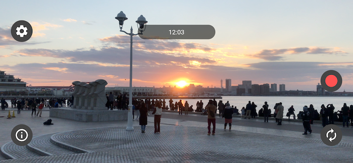
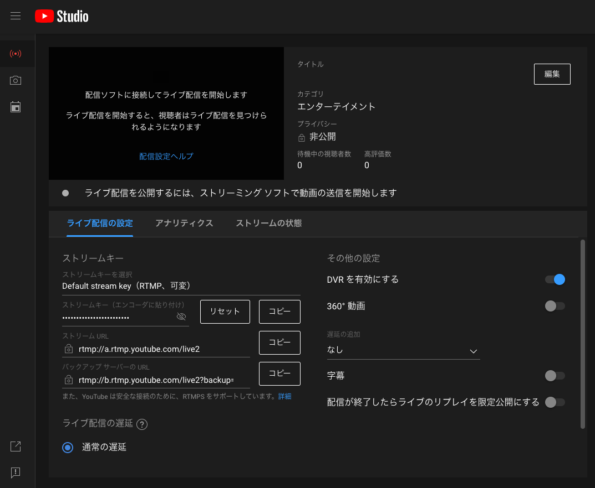

# It's my Live

  

## :blue_book: Features

**It's my Live**  is a live streaming app made with FLutter. Compatible with RTMP and SRT.

## :blue_book: YouTube (RTMP)


Enter URL and KEY in App. Note that the KEY changes each time the button is pressed.

## :blue_book: AWS MediaLive

**RTMP**
e.g. rtmp://xxxx/test/abcd  
URL = rtmp://xxxx/test  
KEY = abcd

**SRT**
URL = srt://xxxx:5000  

## :blue_book: Nginx (RTMPs)

URL = rtmp://(pc_ip):1935/live
KEY = live

**Modify nginx.conf file**
/etc/nginx/nginx.conf

```
rtmp {
  server {
    listen 1935;
    chunk_size 4096;
    access_log /var/log/rtmp_access.log;
    application live { 
        live on;
        record off;
    }
  }
}
```

## :blue_book: PC and ffplay

**RTMP**
PC (need nginx)
ffplay -i "rtmp://0.0.0.0:1935/live/live"

It's my Live
URL = rtmp://(pc_ip):1935/live
KEY = live

**SRT**
PC 
ffplay -i "srt://0.0.0.0:5000?mode=listener"

It's my Live
URL = srt://(pc_ip):5000

## :blue_book: Build

:file_folder: ItsMyLive  
:file_folder: mylive_libraly  

mylive_libraly is required to build ItsMyLive.  


