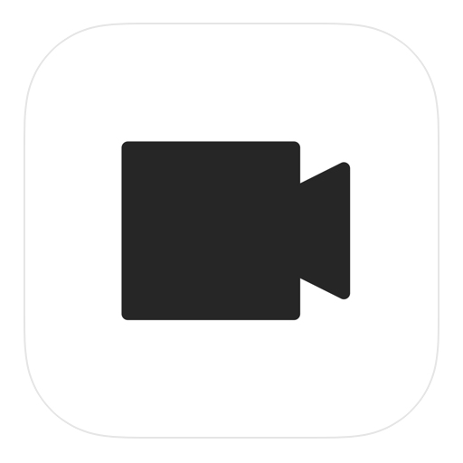

# It's my Live




## :blue_book: Features

**It's my Live** is a live distribution application.

## :blue_book: YouTube


Enter URL and KEY in App. Note that the KEY changes each time the button is pressed.

## :blue_book: AWS MediaLive

e.g. rtmp://xxxx/test/abcd  
URL = rtmp://xxxx/test  
KEY = abcd

## :blue_book: Nginx

URL = rtmp://(pc_ip):1935/live
KEY = live

**Modify nginx.conf file**
/etc/nginx/nginx.conf

```
rtmp {
  server {
    listen 1935;
    chunk_size 4096;
    access_log /var/log/rtmp_access.log;
    application live { 
        live on;
        record off;
    }
  }
}
```

## :blue_book: PC and ffplay
### Rtmp
- PC (need nginx)
  ffplay -i "rtmp://0.0.0.0:1935/live/live"
- It's my Live
  url rtmp://(pc_ip):1935/live
  key live

### Srt
- PC 
  ffplay -i "srt://0.0.0.0:5000?mode=listener"
- It's my Live
  url srt://(pc_ip):5000

